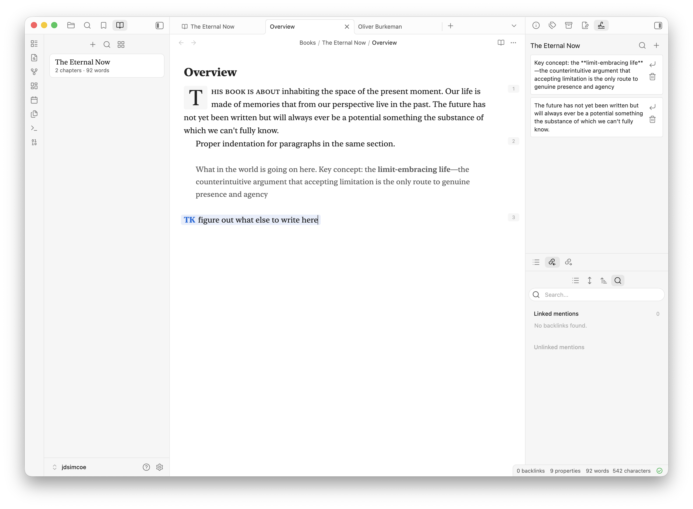

# Books

Books is an Obsidian plugin for writing and organizing long-form manuscripts in your vault. It adds a dedicated book authoring environment on top of regular Markdown files, with a left-side book navigator, a spine view for structuring chapters, writerly manuscript styling, scratchpad capture, and Markdown export.

Books are stored locally in your vault under `Books/`. No cloud service, telemetry, or external account is required.



## Features

- **Books navigator**: A left sidebar view that lists your books with chapter and word counts.
- **Book spine view**: A main workspace view for organizing a book into sections, chapters, interludes, appendices, back matter, and canvases.
- **Drag reordering**: Reorder chapters, move chapters into/out of sections, and rearrange sections directly in the spine.
- **Readable manuscript tabs**: Book files keep stable storage filenames while displaying human-readable book and chapter titles in the editor UI.
- **Writerly manuscript styling**: Book chapters get a focused writing treatment with serif typography, drop caps, paragraph indentation, paragraph numbering, small caps, and TK highlighting.
- **Scratchpad**: Save snippets from selections into a per-book scratchpad, search them, drag them back into a chapter, or insert at the cursor.
- **Research sidebar**: Search recent notes and note blocks outside `Books/`, then insert them as publishable blockquote citations.
- **Canvas support**: Add Obsidian canvases into a book spine for idea exploration alongside prose chapters.
- **Markdown export**: Compile the ordered spine into one Markdown manuscript file for handoff to Word, Google Docs, LaTeX, HTML, or other tools.
- **Books mode**: Opening a book chapter or spine switches the left sidebar to Books; opening regular notes switches back toward Files.

## How it stores books

Books creates a vault-root folder:

```text
Books/
  My Book/
    book.json
    scratchpad.json
    Introduction.md
    Chapter 1.md
    Ideas.canvas
```

`book.json` is the source of truth for book metadata and spine ordering. Markdown and canvas files remain normal vault files so they can be opened, linked, searched, synced, and backed up like any other Obsidian note.

Book entries receive frontmatter such as:

```yaml
title: Introduction
bookId: book-...
bookTitle: My Book
sectionId: entry-...
sectionType: intro
sectionTitle: Introduction
sectionOrder: 1
genre: fiction
```

Filenames are allowed to differ from display titles. The plugin keeps file references stable while presenting readable labels in book views and editor chrome.

## Main views

### Books navigator

The Books navigator lives in the left sidebar. It supports:

- Creating books.
- Searching books.
- Switching between list and grid layouts.
- Opening a book spine in the main workspace.
- Deleting a book folder through Obsidian trash.

### Spine view

The spine view is the control center for a book. It supports:

- Editing book title, genre, status, and description.
- Adding sections/parts.
- Adding chapters, intros, interludes, appendices, and back matter.
- Adding canvases.
- Dragging chapters and sections to reorder the manuscript.
- Opening chapters in new tabs.
- Removing entries from the spine while keeping the file.
- Removing entries and sending the file to trash.
- Compiling the spine into a single Markdown export.

### Scratchpad

Each book can have a `scratchpad.json` file. The scratchpad view lives in the right sidebar and tracks the active book. It supports:

- Saving selected text via the editor context menu.
- Creating snippets manually.
- Searching snippets.
- Dragging snippets into the editor.
- Inserting snippets at the cursor.
- Deleting snippets.

### Research sidebar and citations

The research sidebar searches non-book notes and blocks. It inserts normal Markdown blockquotes with footnotes, so draft material can move toward publishing without relying on Obsidian-only embed rendering.

Books also registers a Books-only `@` suggester inside book chapters. Type `@query`, choose a note or block, and Books inserts:

```markdown
> Quoted research text.[^1]

[^1]: Price, D. (2018, March 23). *Laziness does not exist*. Medium. https://example.com/laziness-does-not-exist
```

If the source note has frontmatter such as `sourceURL`, `sourceUrl`, `source_url`, `url`, `sourceTitle`, `source`, `title`, `author`, `byline`, `datePublished`, `publishedDate`, `publishedAt`, `published`, `sourceDate`, `date`, `siteName`, `site`, `publication`, `publisher`, or `website`, Books uses that metadata to approximate an APA 7 webpage citation. Otherwise it links back to the source note with a readable title alias.

## Manuscript styling

Books applies manuscript styling only to files inside `Books/`. The manuscript treatment includes:

- Serif writing typography using `ui-serif`, New York, Georgia, and system fallbacks.
- Drop caps for chapter openings.
- First-line indentation for paragraph flow.
- Paragraph numbering.
- Small-caps treatment for section openings.
- TK marker highlighting for drafting placeholders.
- Lighter Mirror embed styling for legacy Mirror references, though Books' own research insertion prefers publishable blockquote citations.

## Commands

- **Open library**
- **Create book**
- **Create chapter**
- **Open research sidebar**

Books also adds **Save to scratchpad** to the editor context menu when text is selected.

## Development

Install dependencies:

```bash
npm install
```

Run a production build:

```bash
npm run build
```

Run lint:

```bash
npm run lint
```

Run the esbuild watcher:

```bash
npm run dev
```

The bundled plugin entry is `main.js`. It is generated locally for Obsidian but ignored by git.

## Release artifacts

An Obsidian release should include:

- `manifest.json`
- `main.js`
- `styles.css`

## Notes

- Books currently exports compiled manuscripts as Markdown.
- EPUB, DOCX, LaTeX, and HTML export can build on the existing Markdown compiler.
- All book data is local to the vault.
